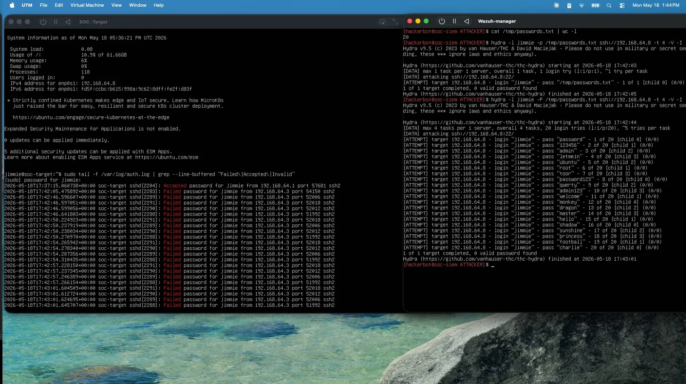
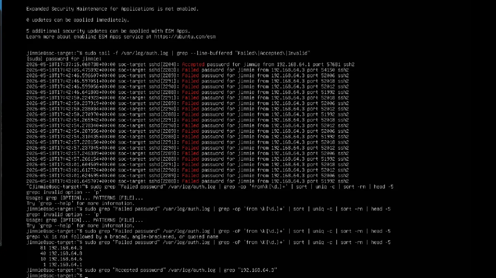
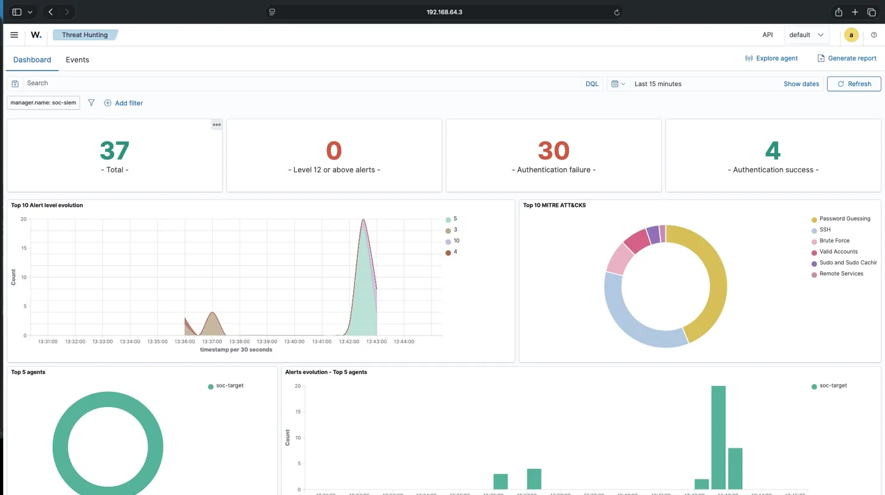
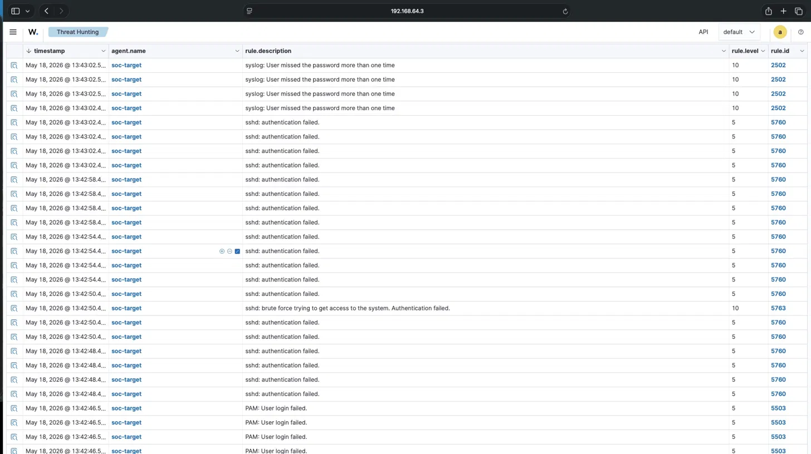
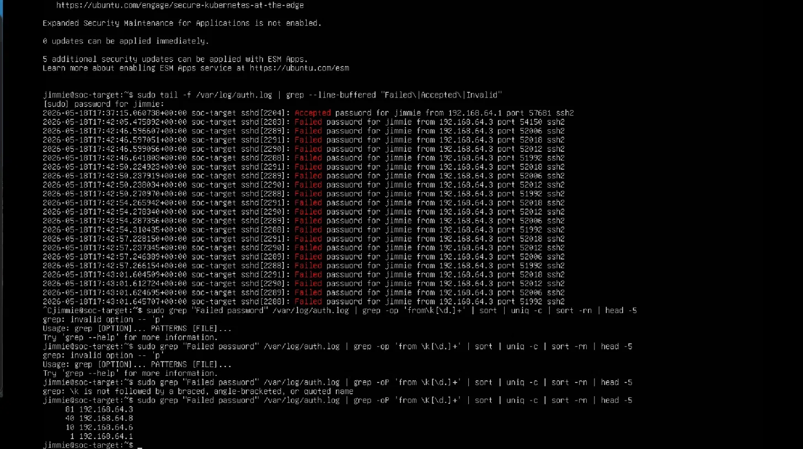
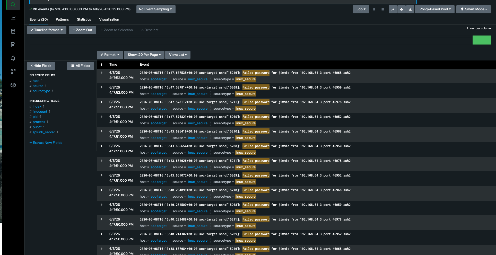
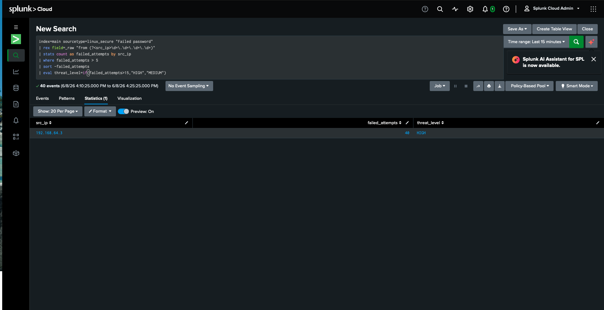

# SOC Lab: SSH Brute Force Detection, Live Forensics & SIEM Monitoring

## Table of Contents
1. [Lab Architecture](#1-lab-architecture)
2. [Objective](#2-objective)
3. [Version 1 — Initial Build](#3-version-1--initial-build-physical-lab)
4. [Version 2 — Enterprise Virtual Lab](#4-version-2--enterprise-virtual-lab-apple-silicon)
5. [The Attack — Hydra SSH Brute Force](#5-the-attack--hydra-ssh-brute-force)
6. [Live Detection — Tail Stream](#6-live-detection--real-time-log-stream)
7. [SIEM Detection — Wazuh Dashboard](#7-siem-detection--wazuh-dashboard)
8. [Linux Forensics Investigation](#8-linux-forensics-investigation)
9. [MITRE ATT&CK Mapping](#9-mitre-attck-mapping)
10. [Key Commands Reference](#10-key-commands-reference)
11. [What This Proves](#11-what-this-proves)

---

## 1. Lab Architecture

### Version 1 (Physical)


### Version 2 (Virtual — Apple Silicon M3)


**Network:** UTM Shared Network — isolated 192.168.64.0/24  
**Hypervisor:** UTM on Apple Silicon M3  
**OS:** Ubuntu Server 24.04 LTS ARM64 (both VMs)

---

## 2. Objective

Simulate a real-world SSH brute force attack against a monitored Linux endpoint,
validate end-to-end detection through a Wazuh SIEM, and conduct a full Linux
forensics investigation using native bash tooling — proving both detection
engineering capability and analyst-level log forensics skills.

---

## 3. Version 1 — Initial Build (Physical Lab)

**Hardware:** Physical Asus Ubuntu server + Kali Linux VM  
**SIEM:** Wazuh (single-node)  
**Attack tool:** Hydra (dictionary-based SSH brute force)

### Evidence: Raw Auth Logs (Physical Server)


### Evidence: Wazuh Alert Spike


---

## 4. Version 2 — Enterprise Virtual Lab (Apple Silicon)

**Upgrade from V1:**
- Separated attacker and victim into dedicated VMs on isolated virtual network
- Deployed full Wazuh stack (Manager + Indexer + Dashboard) on dedicated SIEM host
- Added dedicated attacker account (`hackerbot`) with color-coded terminal prompt
- Implemented live log streaming for real-time detection validation
- Added Linux forensics investigation layer with documented bash methodology

---

## 5. The Attack — Hydra SSH Brute Force

**Attacker:** `hackerbot@soc-siem` (192.168.64.3)  
**Target:** `jimmie@soc-target` (192.168.64.8)  
**Tool:** THC-Hydra v9.5  
**Wordlist:** 20-password dictionary  
**Threads:** 4 parallel  
**Duration:** ~60 seconds  
**Result:** 0 valid passwords found — attack failed, access denied

**Attack command:**
```bash
hydra -l jimmie -P /tmp/passwords.txt ssh://192.168.64.8 -t 4 -V -I
```

### Evidence: Hydra Firing + Live Log Stream Simultaneously


---

## 6. Live Detection — Real-Time Log Stream

While the attack was running, a live detection stream was active on the target:

```bash
sudo tail -f /var/log/auth.log | grep --line-buffered "Failed\|Accepted\|Invalid"
```

This command streams authentication events in real time — failed attempts appear
highlighted as they land, and legitimate logins (`Accepted password`) are caught
immediately in the same stream.

**Key observation:** The analyst's own SSH login from 192.168.64.1 appeared as
`Accepted password` in the live stream — proving the detection catches both
attack traffic and legitimate admin activity simultaneously.

### Evidence: Live Tail Stream During Attack


---

## 7. SIEM Detection — Wazuh Dashboard

### Alert Summary (Last 15 Minutes During Attack)
| Severity | Count | Meaning |
|---|---|---|
| Critical (Level 15+) | 0 | No full compromise |
| High (Level 12-14) | 0 | No escalation to critical |
| Medium (Level 7-11) | 30 | Correlation rules fired |
| Low (Level 0-6) | 7 | Individual auth failures |

### Wazuh Correlation Rules Fired
| Rule ID | Level | Description |
|---|---|---|
| 5760 | 5 | sshd: authentication failed |
| 5763 | 10 | **sshd: brute force trying to get access to the system** |
| 2502 | 10 | **syslog: User missed the password more than one time** |
| 5503 | 5 | PAM: User login failed |

**Rule 5763 and 2502 at level 10 are the key detection events** — these are
Wazuh's correlation rules that escalate from individual failures to a confirmed
brute force pattern automatically, with zero manual configuration.

### Evidence: Wazuh Threat Hunting Dashboard


### Evidence: Wazuh Events Table (Rule IDs and Levels)


---

## 8. Linux Forensics Investigation

All investigation performed using native bash tooling on `/var/log/auth.log`.
No SIEM required — proving analyst capability at the endpoint level.

### Q1: How many failed login attempts occurred?
```bash
sudo grep -c "Failed password" /var/log/auth.log
# Result: 20 (most recent clean attack run)
```

### Q2: Which IP attacked most aggressively?
```bash
sudo grep "Failed password" /var/log/auth.log \
  | grep -oP 'from \K[\d.]+' \
  | sort | uniq -c | sort -rn | head -5
# Result:
#   81  192.168.64.3   ← soc-siem (attacker — accumulated across runs)
#   40  192.168.64.8   ← earlier self-attack runs (architecture error, corrected)
#   10  192.168.64.6   ← prior session
#    1  192.168.64.1   ← analyst Mac (legitimate SSH)
```

### Q3: Which usernames were targeted?
```bash
sudo grep "Failed password" /var/log/auth.log \
  | grep "192.168.64.3" \
  | awk '{print $7}' | sort | uniq
# Result: jimmie
```

### Q4: What was the attack time range?
```bash
# First attempt:
sudo grep "Failed password" /var/log/auth.log | grep "192.168.64.3" | head -1
# 2026-05-13T17:10:00.227054+00:00

# Last attempt:
sudo grep "Failed password" /var/log/auth.log | grep "192.168.64.3" | tail -1
# 2026-05-13T17:10:09.250984+00:00

# Attack duration: 9 seconds
# 20 passwords, 4 parallel threads, unprotected SSH = 9 seconds to exhaust wordlist
```

### Q5: Did any attempts succeed?
```bash
sudo grep "Accepted password" /var/log/auth.log | grep "192.168.64.3"
# Result: (no output)
# Conclusion: Zero successful logins from attacker IP. Attack failed.
# Only accepted logins are from 192.168.64.1 (analyst's Mac — legitimate admin)
```

### Q6: Live detection one-liner (use during active attacks)
```bash
sudo tail -f /var/log/auth.log | grep --line-buffered "Failed\|Accepted\|Invalid"
```

### Q7: The money one-liner (rank attackers by attempt volume)
```bash
sudo grep "Failed password" /var/log/auth.log \
  | grep -oP 'from \K[\d.]+' \
  | sort | uniq -c | sort -rn | head -5
```

### Evidence: Forensics Commands Running


### Evidence: Zero Accepted Passwords From Attacker

---

## 9. MITRE ATT&CK Mapping

| Technique ID | Name | How It Appears In This Lab |
|---|---|---|
| T1110 | Brute Force | Parent technique — Hydra exhausting a wordlist |
| T1110.001 | Password Guessing | Hydra trying known passwords against `jimmie` |
| T1021.004 | Remote Services: SSH | SSH as the attack vector |
| T1078 | Valid Accounts | Wazuh flagging legitimate `Accepted password` events |

**Wazuh auto-mapped all four techniques** to the MITRE ATT&CK framework without
any manual configuration — visible in the Threat Hunting dashboard.

### Evidence: MITRE ATT&CK Mapping in Wazuh


---

## 10. Key Commands Reference

```bash
# Count failed logins
sudo grep -c "Failed password" /var/log/auth.log

# Show last N failed logins
sudo grep "Failed password" /var/log/auth.log | tail -20

# Filter failed logins by specific attacker IP
sudo grep "Failed password" /var/log/auth.log | grep "192.168.64.3"

# Check for successful logins from attacker
sudo grep "Accepted password" /var/log/auth.log | grep "192.168.64.3"

# Rank attacker IPs by attempt count
sudo grep "Failed password" /var/log/auth.log \
  | grep -oP 'from \K[\d.]+' \
  | sort | uniq -c | sort -rn | head -5

# Live monitoring during active attack
sudo tail -f /var/log/auth.log | grep --line-buffered "Failed\|Accepted\|Invalid"

# Extract unique targeted usernames
sudo grep "Failed password" /var/log/auth.log \
  | grep "192.168.64.3" \
  | awk '{print $7}' | sort | uniq
```

---

## 11. What This Proves

**Architecture:** Ability to design and deploy a multi-host SOC lab with proper
attacker/victim separation, isolated virtual networking, and distributed agent
telemetry — mirroring real enterprise SIEM deployments.

**Detection Engineering:** End-to-end validation of the detection pipeline —
from raw log entry → Wazuh agent collection → manager correlation → level-10
brute force alert → MITRE ATT&CK auto-mapping. Zero manual configuration required.

**Linux Forensics:** Demonstrated ability to investigate a brute force attack
using only native bash tooling (grep, awk, sort, uniq, head, tail) — answering
all key investigative questions: volume, source, targets, time range, and outcome.

**Analyst Discipline:** Proven ability to distinguish attacker traffic from
legitimate admin activity in the same log, identify architecture errors during
investigation, and iterate to clean evidence. No SIEM required for ground-truth
forensics.

**MITRE ATT&CK:** Techniques T1110, T1110.001, T1021.004, and T1078 all
validated and visualized in the Wazuh dashboard.

---

*Lab environment: UTM hypervisor on Apple Silicon M3 |
Wazuh 4.14.5 | Ubuntu Server 24.04 ARM64 |
CompTIA Security+ CE | CompTIA CySA+ CE | Active TS Clearance*

---

---

## Version 3 — Splunk Cloud SIEM + SPL Detection Engineering

**Upgrade from V2:** Integrated a second enterprise SIEM platform alongside Wazuh.
Ingested live `auth.log` telemetry into Splunk Cloud via a custom Python/HEC pipeline
and authored a custom SPL detection rule that automatically identifies and
severity-rates brute force attacks — no manual analysis required.

---

### Architecture

- **Data Pipeline:** Python script using HTTP Event Collector (HEC) ships
  `auth.log` from `soc-target` directly to Splunk Cloud — no native forwarder agent required
- **SIEM:** Splunk Cloud (`prd-p-1q6pg.splunkcloud.com`)
- **Detection:** Custom SPL analytics rule with automated threat-level scoring

---

### The SPL Detection Rule

```spl
index=main sourcetype=linux_secure "Failed password"
| rex field=_raw "from (?<src_ip>\d+\.\d+\.\d+\.\d+)"
| stats count as failed_attempts by src_ip
| where failed_attempts > 5
| sort -failed_attempts
| eval threat_level=if(failed_attempts>15,"HIGH","MEDIUM")
```

**Line by line:**
- `index=main sourcetype=linux_secure "Failed password"` — isolate failed SSH login events
- `rex` — surgically extract the attacker IP into a clean field
- `stats count` — aggregate attempt volume per source IP
- `where failed_attempts > 5` — filter out noise, surface only real threats
- `eval threat_level` — auto-score severity: HIGH above 15 attempts, MEDIUM above 5

---

### Detection Result

| src_ip | failed_attempts | threat_level |
|---|---|---|
| 192.168.64.3 | 40 | HIGH |

Attacker IP `192.168.64.3` (soc-siem attacker account) flagged HIGH automatically.
Zero manual triage required.

---



---

### What This Proves

- **Custom data ingestion:** Python/HEC pipeline delivers logs to Splunk Cloud
  without native agent support — mirrors real-world custom sensor integration
- **SPL authoring:** Written from scratch, not a template — field extraction,
  statistical aggregation, threshold filtering, and conditional scoring in one query
- **Dual-SIEM environment:** Wazuh (open-source, on-premises) and Splunk Cloud
  (enterprise, cloud-native) running simultaneously against the same endpoint —
  demonstrates platform versatility across the two most common SOC SIEM stacks
- **Detection engineering mindset:** The query doesn't just find events —
  it ranks, filters, and scores them automatically, reducing analyst workload

---

*Week 2 completed: June 8, 2026 | Tools: Splunk Cloud, SPL, Python, HEC API*
