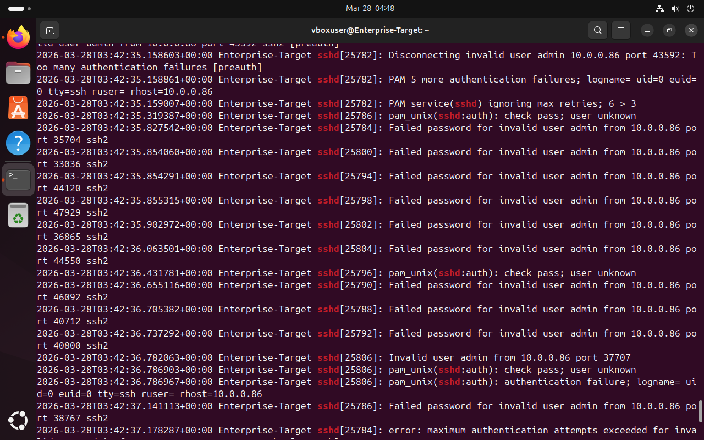
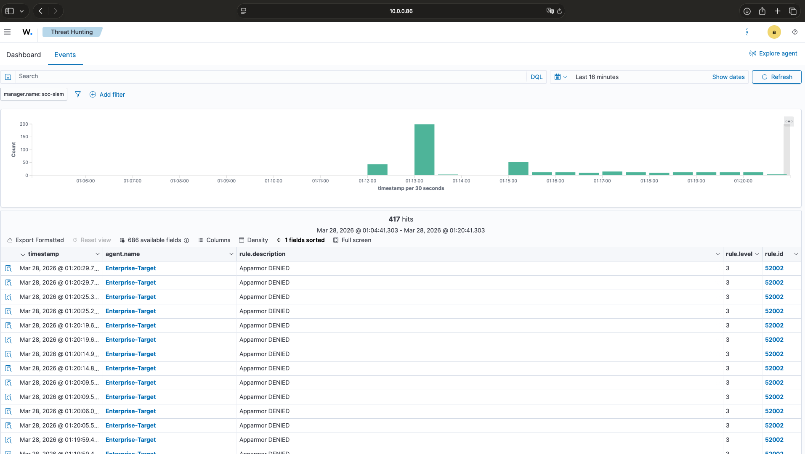

# SOC Lab: Active Threat Detection & SIEM Monitoring

## 1. Network Topology

## 2. The Objective
Simulate a brute-force attack from a Kali Linux "Attacker" machine against an Ubuntu "Target" server, and monitor the detection via a Wazuh SIEM.

## 3. The Evidence: Raw Logs (Asus/Ubuntu Server)
This photo shows the raw SSH authentication failures as they happened on the physical Asus server.

## 4. The Evidence: SIEM Alert (Wazuh Dashboard)
This screenshot shows how the Wazuh Manager identified the attack and triggered a high-severity alert.

