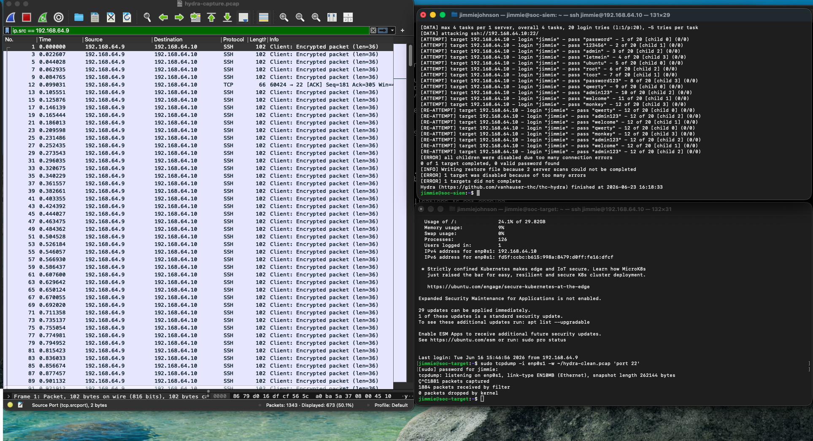

# Week 5 — Network Forensics: Wireshark Packet Analysis

## Objective
Capture and analyze live SSH brute-force attack traffic at the 
packet level using tcpdump and Wireshark — proving an automated 
attack occurred even without SIEM alerts or system logs.

## Tools Used
- tcpdump (packet capture on Ubuntu target)
- Wireshark 4.6.6 (packet analysis on Mac)
- Hydra (controlled attack from soc-siem)

## What I Proved
- Captured 1,343 packets of SSH traffic during a controlled 
  Hydra brute-force campaign
- Identified attack source IP via Source column pattern recognition
- Distinguished automated attack from human behavior using 
  millisecond timestamp analysis
- Decoded packet Info column: SYN (new attempt), ACK (receipt), 
  RST (rejection/ban), Encrypted packet (auth attempt)
- Confirmed packet size uniformity (102 bytes) as brute-force 
  signature vs variable sizes in legitimate sessions

## Key Finding
Network forensics provides evidence independent of system logs. 
If an attacker wipes auth.log, the PCAP still shows the attack. 
Automated tools leave a timing signature no human can replicate.

## MITRE ATT&CK Mapping
T1110.001 — Brute Force: Password Guessing
Evidence visible at: packet timing, RST storm, single-source 
high-volume port 22 connections

## Evidence Screenshots

### Brute Force Filter Applied

*Filter ip.src == 192.168.64.9 — 673 of 1,343 packets were attacker traffic*

### Full Capture — All 1,343 Packets

*Unfiltered view showing complete attack traffic recorded by tcpdump*

### Packet Detail Pane

*Single packet expanded — shows TCP/SSH protocol layers and connection metadata*

## Evidence

### Live Attack Capture — Wireshark + Hydra

*ip.src == 192.168.64.9 filter applied — 673 of 1,343 packets confirmed attacker traffic from soc-siem against soc-target port 22*
